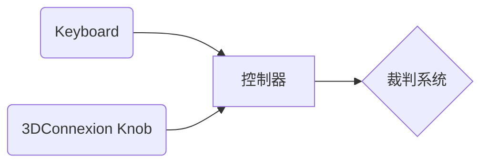
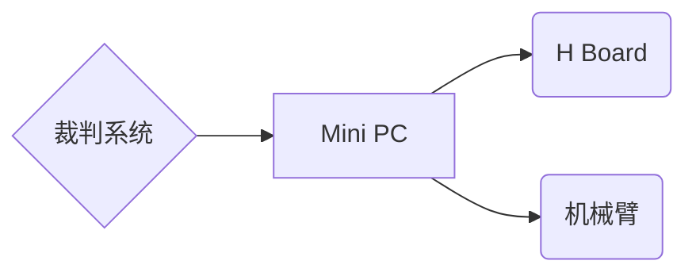

# RM2023 工程+机械臂控制手册-草稿1
## 说明：控制方式分三种
### 1. 基础：只用键鼠操作，对应自定义控制器失效的情况
### 2. 正常：可简单实现的自定义控制器操作方式
### 3. 高级：带上一系列CV功能，实现部分自动化，增加效率
+ 平面对准
+ 坐标系对准
+ 自动伸过去吸矿

## 1. 基础硬件
### 操作手处
#### 主设备
如图，左手处为键盘，右手为3DConnexion六轴摇杆。
键盘以及摇杆由数据经单片机处理之后由UART传输给裁判系统，作为自定义控制器信号。

#### 备用设备: 自定义控制器失效的情况下
传统键鼠操作方式。数据不经过自定义控制器通道。

### 机器人（工程车）处
#### 若使用自定义控制器
从裁判系统走出的自定义控制器信号由USB-TTL模块被MiniPC读取。
其中底盘操作信号被转发给底盘H板；机械臂操作信号经MiniPC上ROS解算后，把电机控制信息发送给机械臂。

#### 传统控制器的控制方式
//Todo

## 2. 操作方式

## 3. 