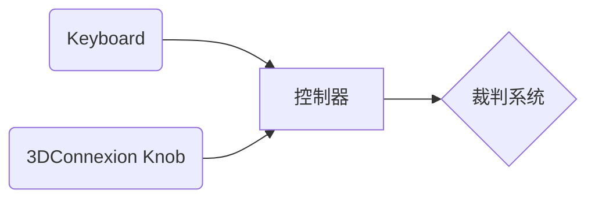
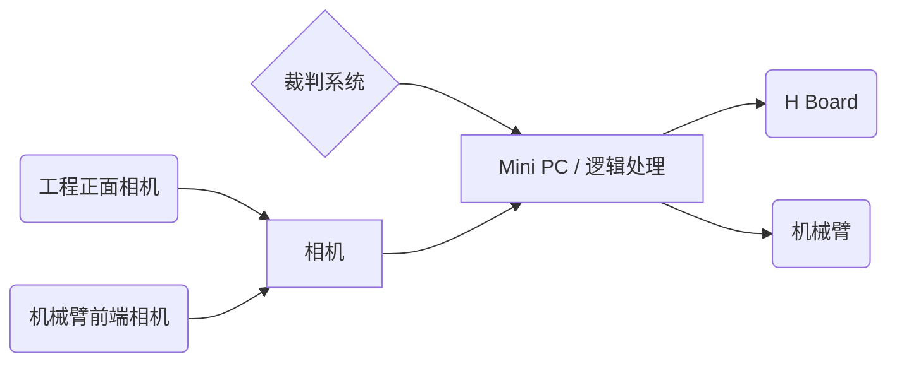

# RM2023 工程+机械臂控制手册-草稿1
## 说明：控制方式分三种
### 1. 基础：只用键鼠操作，对应自定义控制器失效的情况
### 2. 正常：可简单实现的自定义控制器操作方式
### 3. 高级：带上一系列CV功能，实现部分自动化，增加效率
+ 平面对准
+ 坐标系对准
+ 自动伸过去吸矿

## 1. 基础硬件
### 操作手处
#### 主设备
如图，左手处为键盘，右手为3DConnexion六轴摇杆。
键盘以及摇杆由数据经单片机处理之后由UART传输给裁判系统，作为自定义控制器信号。

#### 备用设备: 自定义控制器失效的情况下
传统键鼠操作方式。数据不经过自定义控制器通道。

### 机器人（工程车）处

#### 若使用自定义控制器
从裁判系统走出的自定义控制器信号由USB-TTL模块被MiniPC读取。
其中底盘操作信号被转发给底盘H板；机械臂操作信号经MiniPC上ROS解算后，把电机控制信息发送给机械臂。

#### 传统控制器
//Todo

## 2. 操作方式
### 底盘移动模式 vs 机械臂移动模式
使用Shift键切换两种模式。
3DConnexion六轴摇杆操作移动，键盘作为辅助/模式切换。
### 坐标系切换（机械臂移动模式下）
按住Control时，使用世界坐标系（暂且设定为工程底盘坐标系）。
松开Control时，使用第一人称坐标系（前后左右上下均以机械臂前端相机为准）。

## 3. CV相关
###  平面对准
#### 设计原因
新兑换站矿石是歪的，如果角度没调整好，吸盘吸不上。所以把校准角度的流程自动化，加快效率。
#### 操作流程
1. CV自动识别图像中的矿石表面，并在图传中标注。
2. 操作手通过键盘来选取想要的表面。
3. 获取选中表面的yaw roll pitch，作为机械臂终端的姿态，提交给ROS。
#### 大致实现
//Todo
###  世界坐标系对准
#### 设计原因
方便“把机械臂从一个矿移到第二个矿”这个操作。
#### 操作流程
1. CV自动识别图像中兑换站结构，并在图传中标注。
2. 操作手通过键盘来选取正确的坐标轴位置。
3. 获取这个坐标轴，把它当作工程的世界坐标系的一个轴。
#### 大致实现
//Todo
###  自动伸过去吸矿
//Todo